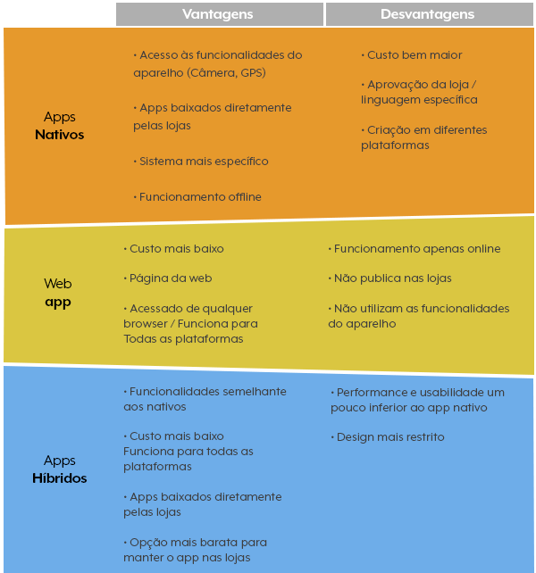

# Mobile

## Importância dos smartphones

No ano de 2007, a Apple lançou o primeiro iPhone, e com ele, uma nova era de dispositivos móveis.

Desde então, os smartphones se tornaram uma parte essencial da vida cotidiana, e a maioria das pessoas não consegue imaginar a vida sem eles.

---

Grande parte da população mundial possui um smartphone, e a tendência é que esse número cresça cada vez mais.

Existem diversos estudos estimando que mais da metade da população mundial já possui e usa um smartphone.

Isso significa que a maioria das pessoas tem um dispositivo móvel, e que a maioria das pessoas passa a maior parte do tempo usando aplicativos.

---

### Reflexão

- **_Você já parou para pensar na importância dos smartphones e aplicativos?_**

- **_Quais aplicativos você conhece que mudaram a maneira que as pessoas vivem?_**

- **_Quais aplicativos você usa no seu dia a dia?_**

---

## Apps nativos e híbridos

> Apps nativos

São aplicativos desenvolvidos para uma plataforma específica, como Android ou iOS, escritos em linguagens de programação específicas para cada plataforma.

> Apps híbridos

São aplicativos desenvolvidos com tecnologias web/não nativas, como HTML, CSS e JavaScript, e são encapsulados em um aplicativo nativo, como Cordova, PhoneGap.

---



[Diferença entre web app, app nativo e híbrido](https://blog.fabricadeaplicativos.com.br/fabapp/qual-diferenca-entre-web-app-app-nativo-e-aplicativo-hibrido/)

---

## React Native

> Por que React Native ?

- É uma framework open source, criada pelo Facebook (Meta) que segue os princípios do React;

- Com um único código, é possível criar aplicações Android e iOS, salvando tempo e esforço que dois projetos separados podem causar, o mesmo vale para manutenção do código;

---

- Seu desempenho é bem semelhante ao desempenho de aplicações nativas, pois são transpiladas em componentes nativos de cada plataforma (iOS / Android);

- Comunidade grande e ativa, o ecossistema é enorme e possui diversas bibliotecas e soluções já prontas para muitos casos de uso, integração de serviços, etc;

- Quantidade de documentação, tutorial e fóruns disponíveis;

- O react native consegue integrar com bases de códigos que já utilizam código nativo, sendo possível criar funcionalidades usando a framework em projetos nativos já existentes.

---

### Pré requisitos

1. Conhecimento básico de **_JavaScript/TypeScript_**, pois é a linguagem utilizada.

1. **_NodeJS_** e **_npm_**, pois Node é onde o código JS é interpretado e executado, fora dos navegadores e **_npm_** que é o gerenciador de pacotes, responsável para instalar e gerenciar bibliotecas terceiras.

1. Expo / React Native CLI.

1. Editor de código (VSCode).

1. Android Studio para Android e XCode para iOS.

---

## 2. Começando com React Native

> Básico de JavaScript

Para trabalhar com react native é importante ter um bom entendimento de **_JavaScript_**, pois é a linguagem utilizada para desenvolver as aplicações.

- **_Variáveis_** e **_tipos de dados_**;
- **_Funções_**;
- **_Objetos_**;
- **_Arrays_**;
- **_Controles de fluxo_**;

---

> ES6

O **_ES6_** (ECMAScript 6) é uma versão do JavaScript que foi lançada em 2015, e trouxe várias novas funcionalidades para a linguagem, essas são bem úteis para o desenvolvimento, como:

- **_Arrow functions_**;
- **_Template strings_**;
- **_Desestruturação_**;
- **_Operador spread_**;

[Exemplos JavaScript](https://snack.expo.dev/@satinp/exemplos-javascript)

---

> Componentes nativos

O react native aproveita **_componentes nativos_**, blocos para construção de telas, fornecidos pelas plataformas móveis nativas (Android e iOS). Esses componentes nativos incluem botões, textos, listas, etc.

[Exemplo de alguns componentes](https://reactnative.dev/docs/components-and-apis)

---

> Virtual DOM e reconciliação

O react native utiliza o conceito de **_Virtual DOM_**, o mesmo conceito utilizado no ReactJS, sendo uma representação do **_Document Object Model_** em memória, mais rápido de manipular e renderizar. Toda vez que ocorre alguma atualização no estado da aplicação, o react native faz uma comparação entre o **_Virtual DOM_** e o **_DOM_** real, e atualiza apenas o que foi alterado, esse processo é chamado **_reconciliação_**.

---

> Arquitetura baseada em componentes

O react native é baseado em **componentes**, onde as telas (UI) são construídas a partir de componentes menores, que podem ser reutilizados em outras telas, ou até mesmo em outras aplicações.

Os componentes são unidades independentes que encapsulam lógica e apresentação (UI), promovendo o reuso de código, modularidade e manutenibilidade.

---

O React native possui duas categorias de componentes, os componentes **_funcionais_** e componentes de **_classe_**. Atualmente é recomendado pelos próprios criadores que se utilize **componentes funcionais**.

[Utilizando um componente](https://snack.expo.dev/@satinp/componente)

---

> Controle de estado

Conceito essencial para o desenvolvimento, o react native possui várias opções para controle de estado, sendo os dois principais conceitos: **_state_** e as **_props_**.

- **_State_** é um objeto que contém dados que podem ser alterados durante a vida útil do componente. Quando o estado é alterado, o componente é renderizado novamente.

---

- **_Props_** são propriedades passadas dos componentes pai para componentes filho, e não podem ser alteradas durante a vida útil do componente.

[Exemplo de controle de estado com props](https://snack.expo.dev/@satinp/controle-de-estado)

---

## Configurando o ambiente de desenvolvimento

> NodeJS

Para instalar o node, bata baixar a versão LTS, disponível no [Site oficial](https://nodejs.org/en/download). Após a instalação, é possível verificar a versão do node e do npm, através do comando:

```bash
  node -v
```

Com a instalação do node, o **_npm_** também é instalado, para verificar a versão do npm, basta rodar o comando:

```bash
  npm -v
```

---

> VSCode

O VSCode é um editor de código fonte, gratuito e open-source, desenvolvido pela Microsoft. Para instalar o VSCode, basta baixar a versão compatível com o seu sistema operacional, disponível no [Site oficial](https://code.visualstudio.com/download).

---

> Expo

O Expo é uma ferramenta que facilita o desenvolvimento de aplicações React Native, pois possui uma série de ferramentas e bibliotecas já integradas, bem como a possibilidade de rodar o projeto em um emulador ou no **_próprio celular_**. [React Native Expo Go Quick Start](https://reactnative.dev/docs/environment-setup?guide=quickstart)

`(Opcional) - Baixar o aplicativo Expo Go no celular, para rodar o projeto no próprio celular.`

---

### Criando um projeto React Native com Expo

Agora que temos o editor de texto e todas as ferramentas necessárias instaladas, podemos criar o nosso primeiro projeto react native. Para isso, basta abrir o terminal, escolher um diretório e rodar o comando:

```bash
  npx create-expo-app <NomeDoProjeto>
```

Após a instalação, basta entrar no diretório do projeto e rodar o comando:

```bash
  cd <NomeDoProjeto>;
  npx expo start
```

---

Após startar o projeto, aparecerá um QRCode no terminal, basta escanear o QRCode com o aplicativo Expo Go que será possível visualizar o projeto no próprio celular.

Também é possível rodar o projeto em um emulador, para isso, basta ter o [Android Studio](https://developer.android.com/studio) com um [Android Virtual Device](https://developer.android.com/studio/run/emulator#requirements) instalado e rodando, e pressionar `a` no terminal, que o projeto será aberto no emulador.

**_`Todas as instruções para rodar o projeto no emulador ou no próprio celular, estarão disponíveis no terminal após rodar o comando npx expo start.`_**

---

Caso deseje rodar o projeto na web, também é possível, porém é necessário instalar alguns pacotes adicionais, com os seguintes comandos:

```bash
  npx expo install react-dom react-native-web @expo/webpack-config
```

**_`O comando irá instalar as dependências react-dom, react-native-web e @expo/webpack-config.`_**

---

Após a instalação, basta rodar novamente o comando:

```bash
  npx expo start
```

depois, pressionar `w` no terminal, que o projeto será aberto no navegador.

---

### Estrutura do projeto e pastas

> Pastas e arquivos gerados automaticamente pelo `npx create-expo-app`

```bash
  ├── App.js # Arquivo de entrada. Primeiro componente renderizado
  ├── app.json # Configurações do projeto expo
  ├── assets # Imagens, fontes e etc
  │   └── [...]
  ├── babel.config.js # Configurações do bundler para React Native
  ├── node_modules # Onde dependências do projeto são instaladas
  │   └── [...]
  ├── package.json # Dependências, scripts e detalhe do projeto
  ├── package-lock.json # Versões das dependências
  ├── README.md # Documentação do projeto
```

**_node_modules_** é a pasta onde ficam as dependências do projeto e as bibliotecas terceiras para o projeto, todas são geradas automaticamente e gerenciadas pelo npm.

---

### Pré-build, Build, APK e Publicação

> Pre-build

Antes de realizar o build (gerar arquivos para publicar nas lojas), é necessário realizar o **_pre-build_**, que é o processo que gera o código nativo (iOS e Android). Mais informações podem ser encontradas na [Documentação oficial](https://docs.expo.dev/workflow/prebuild/). Comando para realizar o pre-build:

```bash
 npx expo prebuild
```

---

Após executado, serão geradas duas pastas, uma para iOS e outra para Android, com os arquivos nativos. que podem ser executados no XCode e no Android Studio. E serão utilizados para o build. Esse processo é interessante principalmente em casos que se deseja alterar arquivos nativos antes do build.

---

> Build

O Expo recomenda utilizar o [EAS](https://docs.expo.dev/build/setup/) para realizar o build, pois já gera o binário pronto para publicação nas lojas (Google Play Store ou Apple App Store), o único detalhe é que ele exige que você tenha uma conta no [Expo](https://expo.dev/), e que o projeto esteja publicado no [Expo](https://expo.dev/).

---

Para instalar o EAS CLI, basta rodar o comando e em seguida autenticar-se na conta do Expo:

```bash
  npm install -g eas-cli;
  eas login
```

Agora podemos criar um arquivo de configuração para o build, onde podemos definir para qual plataforma ele será buildado (Android, iOS ou ambas), para isso precisamos rodar o comando:

```bash
  eas build:configure
```

---

Após escolher entre Android, iOS ou ambos, será gerado um arquivo de configuração, que pode ser encontrado em `./eas.json`, e pode ser alterado manualmente, caso necessário. Para mais informações sobre o arquivo de configuração, basta acessar a [Configuração do EAS Build com o eas.json](https://docs.expo.dev/build/eas-json/).

---

Agora podemos rodar o comando para realizar o build:

```bash
  eas build
```

Esse comando irá perguntar novamente qual plataforma desejamos buildar, caso escolha **iOS** ou **ambas**, será necessário autenticar-se no Apple Developer. Para evitar isso podemos selecionar para buildar somente Android.

---

Essa etapa de build é feito na **Nuvem do Expo**, por isso é necessário esperar alguns minutos até que o build seja finalizado, pois, existe uma fila no plano gratuito. O comando irá mostrar no terminal um link com os detalhes do build, algo parecido com:

`https://expo.dev/accounts/{conta}/projects/{projeto}/builds/{buildId}`

---

Para fazer a publicação na loja, basta seguir o passo a passo disponível em [Publicar o build](https://docs.expo.dev/build/setup/#deploy-the-build)

Todo o processo de build pode ser encontrado na documentação oficial [Processo de build EAS](https://docs.expo.dev/build-reference/build-configuration/)

---

> Build de produção localmente

Também é possível gerar o build localmente, porém é mais trabalhoso e requer um macOS caso desejamos buildar para iOS. O processo pode ser encontrado em [Build de produção local](https://docs.expo.dev/deploy/build-project/#production-builds-locally).

---

> APK

Também é possível gerar APKs para Android, porém é necessário algumas configurações extras no arquivo `eas.json`. Para mais informações, basta acessar [Configurações para gerar APKs](https://docs.expo.dev/build-reference/apk/#configuring-a-profile-to-build-apks).

---

### Tabela com comandos utilizados

| Comando                               | Ação                                                           |
| :------------------------------------ | :------------------------------------------------------------- |
| `npx create-expo-app <NomeDoProjeto>` | Inicia um projeto expo, `<NomeDoProjeto>` deve ser substituído |
| `npx expo start`                      | Inicia o projeto expo, mostra o QRCode e demais funções        |
| `npx expo install`                    | Instala as dependências do projeto                             |
| `npx expo prebuild`                   | Gera o código nativo iOS e Androxid                            |
| `npm install -g eas-cli`              | Instala o CLI do EAS, utilizado para gerar builds nativas      |

---

| Comando          | Ação                                                |
| :--------------- | :-------------------------------------------------- |
| `eas login`      | Comando para autenticar na conta Expo               |
| `eas whoami`     | Verifica se está autenticado                        |
| `eas build`      | Inicia processo de build para iOS, Android ou ambos |
| `eas build:list` | Lista de builds da sua conta                        |

---
