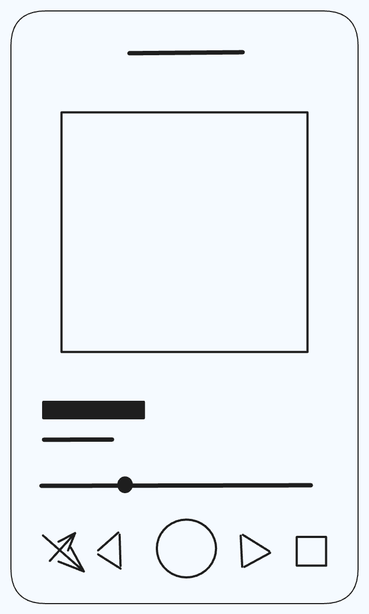

### Questões

1. Desenhe abaixo o esboço de uma interface de uma tela de um aplicativo simples, como uma calculadora ou um tocador de música.

R:

---

2. Identifique os diferentes componentes React Native que serão necessários para construir a interface do exercício anterior. Ex. Aplicativo de música - Componente de Header com uma <View/> e uma <Image /> da logo, Componente de Item da Lista de Música com uma <View />, uma <Image /> com a foto da música e <Text /> com o título e álbum da música.

R:  
Uma `<View />` que engloba todo o conteúdo da página, um `<Text />` que teria o nome do álbum, uma `<Image />` com a capa do álbum, dois componentes `<Text />` um com o nome da música e um com o nome do artista, abaixo teríamos um indicador do tempo da música e em baixo os botões `<Button />` de shuffle, música anterior, play e pause, próxima música e repetir a playlist.

---

3. Descreva como cada componente será estilizado e quais funcionalidades terá. Ex: Header terá o fundo escuro com a logo clara, será clicável e retornará para a tela inicial.

R:  
O background da `<View />` principal é um cinza escuro, o título do álbum é um texto com a cor branca a imagem do álbum teria uma sombra para se destacar do fundo, o texto do nome da música é branco e em negrito e o texto com o nome do artista é branco. O indicador de tempo teria a cor branca e em negrito até o tempo atual da música, todos os botoes brancos e ficariam verdes caso ativados (shuffle/repeat).
