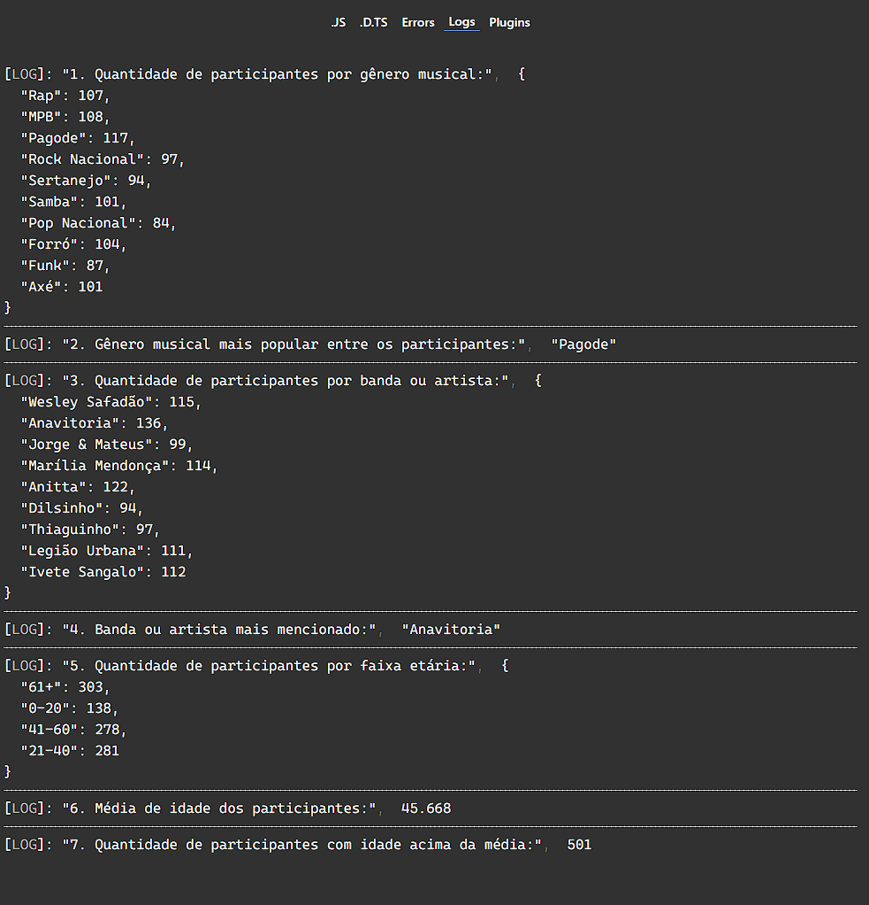

## Questão:

Considere que você está desenvolvendo um sistema para uma empresa organizadora de eventos que deseja coletar informações sobre os participantes de um festival de música. O objetivo é determinar insights sobre os hábitos musicais dos participantes. Para isso, você recebeu um código inicial que gera dados fictícios sobre os participantes. Agora, sua tarefa é completar o código para calcular os resultados desejados com base nos dados gerados.

Aqui está o código inicial que você recebeu:

```typescript
type Participante = {
  generoMusical: string
  bandaArtistaFavorito: string
  idade: number
}

const participantes: Participante[] = []

// Função para gerar participantes fictícios, baseado no parâmetro de quantidade informado.
function gerarParticipantes(numeroParticipantes: number): void {
  for (let i = 0; i < numeroParticipantes; i++) {
    const participante: Participante = {
      generoMusical: gerarGeneroMusicalAleatorio(),
      bandaArtistaFavorito: gerarBandaArtistaAleatorio(),
      idade: Math.floor(Math.random() * 70) + 10, // Gera uma idade entre 10 e 79 anos
    }
    participantes.push(participante)
  }
}

// Função para gerar um gênero musical aleatório, baseado na lista de gêneros.
function gerarGeneroMusicalAleatorio(): string {
  const generos = [
    'Rap',
    'Sertanejo',
    'Funk',
    'Pagode',
    'Samba',
    'MPB',
    'Forró',
    'Axé',
    'Rock Nacional',
    'Pop Nacional',
  ]
  const tamanhoGeneros = generos.length // 10
  return generos[Math.floor(Math.random() * tamanhoGeneros)]
}

// Função para gerar uma banda ou artista aleatório, baseado na lista.
function gerarBandaArtistaAleatorio(): string {
  const bandasArtistas = [
    'Jorge & Mateus',
    'Anitta',
    'Thiaguinho',
    'Dilsinho',
    'Marília Mendonça',
    'Wesley Safadão',
    'Ivete Sangalo',
    'Legião Urbana',
    'Anavitoria',
  ]
  const tamanhoBandas = bandasArtistas.length // 9
  return bandasArtistas[Math.floor(Math.random() * tamanhoBandas)]
}

gerarParticipantes(1000)

// TODO: Calcular os resultados:
// exibirResultados(participantes);
```

Seu objetivo é completar o código fornecido implementando a função `exibirResultados` para calcular e exibir os seguintes resultados:

1. Quantidade de participantes por gênero musical.
2. Gênero musical mais popular entre os participantes.
3. Quantidade de participantes por banda ou artista.
4. Banda ou artista mais mencionado.
5. Quantidade de participantes por faixa etária (0-20, 21-40, 41-60, 61+).
6. Média de idade dos participantes.
7. Quantidade de participantes com idade acima da média.

Você pode utilizar o [playground de typescript](https://www.typescriptlang.org/play) para testar o código, e enviar a resposta completa no formulário: https://forms.gle/k3xuHPYLPcffo9Ab7

Exemplo de resultado, console.log de cada item:



---

### QUESTÃO DISCURSIVA 3
Considere a realização de uma pesquisa com 1 000 pessoas para obtenção das seguintes informações:  
o valor da maior altura;  
o valor da menor altura;  
a média das alturas;  
quantas pessoas têm altura inferior à média das alturas.    

Considere, ainda, que um programador foi selecionado para desenvolver um modelo de código que
soluciona o problema automatizando a coleta das alturas e a geração das informações.  

Com base nas informações apresentadas, desenvolva o código adequado para resolver o problema
usando pseudocódigo ou uma linguagem de programação.  

#### RESPOSTA
```
algoritmo “pesquisa”
  var altura[1000], menor, maior, total=0, media:real
  var qtdmenor=0, ctpessoas: inteiro
  inicio
  leia altura[1]
  menor = altura[1]
  maior = altura[1]
  total = altura[1]
  para ctpessoas=2 até 1000 faça
    leia (altura[ctpessoas])
    total=total + altura[ctpessoas]
  fimpara
  media = total/1000
  para ctpessoas=1 até 1000 faça
    se menor > altura[ctpessoas] então menor = altura[ctpessoas]
    se maior < altura[ctpessoas] então maior = altura[ctpessoas]
    se media > altura[ctpessoas] então qtdmenor = qtdmenor + 1
  fimpara
escreva (“Maior = “, maior, “ Menor= “,menor,” Média= “,media, “ Quantidade de alturas menores que
a média= “,qtdmenor)
```
